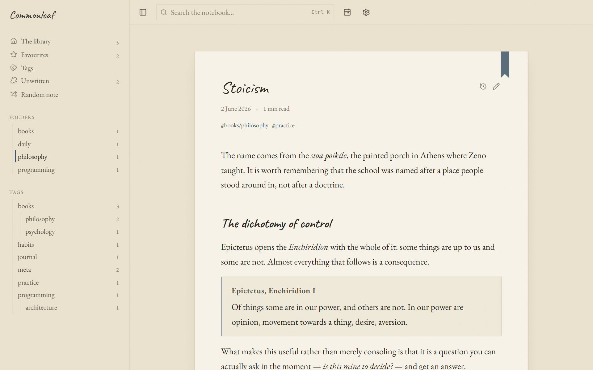
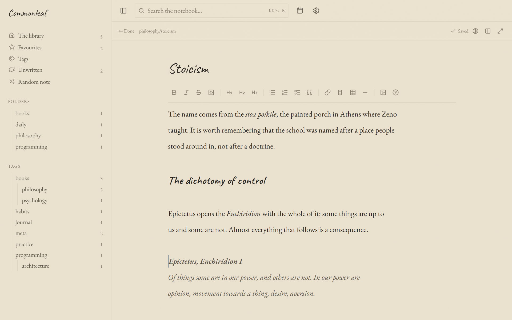
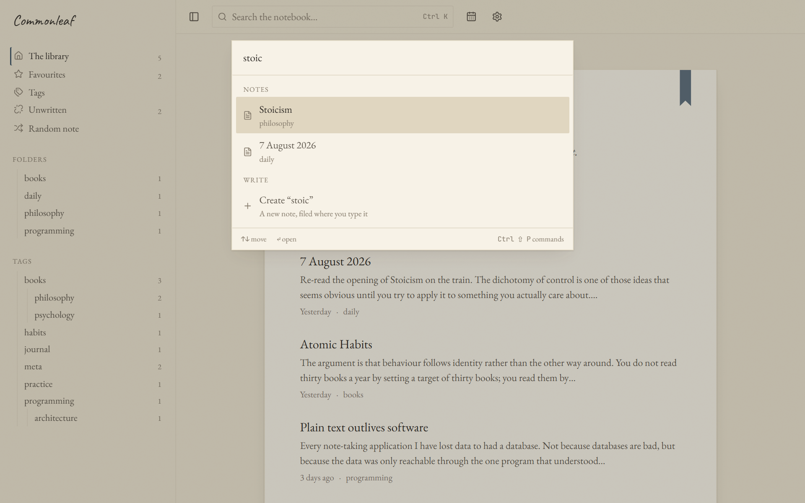
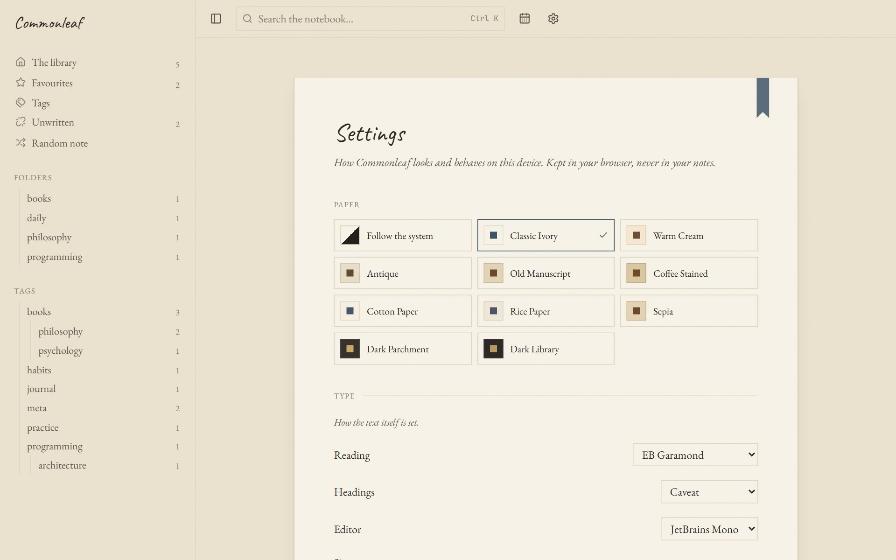

# Commonleaf

**A self-hostable commonplace book, powered by Markdown and Git.**

A commonplace book is where you keep the things worth keeping: a sentence from a
book, an argument you want to remember, a problem you have not solved yet.
Commonleaf is a quiet place to keep them — and to find them again.

Every note is a plain Markdown file in a Git repository you own. There is no
database. If this project disappears tomorrow, you still have a folder of
Markdown files that opens in any editor on any computer. That is the point, not
a fallback.

---

## Screenshots

**Reading a note** — the index, the sheet, the ribbon.



**Writing one.** The formatting toolbar is for people who would rather not learn
Markdown; the text renders as you type either way.



**Finding anything**, with `Ctrl/⌘ K`. Type a title nobody has written and it
offers to write it.



**Ten papers to choose from**, light and dark.



> Regenerate these with `npm run screenshots` — it drives a headless browser
> through the four views and writes to `docs/images/`. See
> [`scripts/screenshots.mjs`](scripts/screenshots.mjs).

---

## What it does

**Writing that does not require Markdown.** The editor renders as you type, so
you look at the note rather than at its source. A formatting toolbar, a `/` menu
of plain-English blocks, and a short syntax card mean you never have to learn a
single symbol — and every shortcut is still there if you already know them.

**Notes that read in order.** A folder is a run of pages: every note offers the
one before and the one after it, so reaching the end of a note is a page turn
rather than a full stop. The order is the order of the files themselves —
rename one and it moves. Nothing is stored to make this work, so a vault from
anywhere already has it.

**Links between notes.** Write `[[Another note]]` and it links. Follow a link to
a note that does not exist yet and Commonleaf offers to write it. Every note
shows what links back to it, quoted in context.

**Folders and nested tags.** File notes in folders; tag them with `#books/philosophy`
and the tag nests under `books`. Both are just where the file is and what is
written in it.

**Writing a new note.** **New note** in the bar asks for a title and nothing
else, and files the note in the folder you are already looking at. `Ctrl/⌘ K`
does the same for a title that turns out not to exist yet.

**Search that is instant.** `Ctrl/⌘ K` searches titles, tags, folders and
excerpts. `Ctrl/⌘ ⇧ P` runs commands.

**Version history from Git.** Every save is a commit with a readable message.
Any past version can be read and restored — restoring writes a new commit, so
history only ever grows.

**Daily notes**, favourites, a random note, and a list of every link you have
written but not yet followed.

**Ten paper themes**, eleven typefaces, adjustable measure, leading and paragraph
spacing, optional paper grain, deckled edges, a stitched binding and a ribbon
bookmark. All of it lives in your browser, never in your notes.

### What it deliberately does not do

No accounts, no multi-user support, no real-time collaboration, no cloud sync,
no AI writing tools, no advertising, no analytics, no telemetry, no tracking, no
notifications. Each of those would compromise something above.

---

## Getting started

Requires Node 20.9 or newer.

```bash
git clone https://github.com/SAKMZ/commonleaf.git
cd commonleaf
npm install
cp .env.example .env.local
npm run dev
```

Then open <http://localhost:3000>.

Out of the box `.env.example` is set up for GitHub. To try it locally against the
sample notes in `content/` without any token at all, put this in `.env.local`:

```bash
STORAGE_DRIVER=filesystem
CONTENT_ROOT=.
CONTENT_DIRECTORY=content
```

---

## Storing your notes in GitHub

1. Create a **private** repository to hold your notes.
2. Create a [fine-grained personal access token](https://github.com/settings/personal-access-tokens)
   scoped to **that one repository**, with **Contents: read and write**. Nothing
   else is needed.
3. Fill in `.env.local`:

```bash
STORAGE_DRIVER=github
GITHUB_TOKEN=github_pat_…
GITHUB_OWNER=your-username
GITHUB_REPOSITORY=your-notes-repo
GITHUB_BRANCH=main
CONTENT_DIRECTORY=content
```

The repository must have at least one commit — a branch has to exist before
anything can be committed to it. A README is enough.

> **The token is read on the server and never sent to the browser.** It is not
> in any bundle, any page and any API response. Keep it in `.env.local` (which is
> gitignored) or in your host's environment variables, and nowhere else.

### Environment variables

| Variable              | Required   | Meaning                                                        |
| --------------------- | ---------- | -------------------------------------------------------------- |
| `STORAGE_DRIVER`      | no         | `github` (default) or `filesystem`.                            |
| `GITHUB_TOKEN`        | github     | Fine-grained token, Contents: read and write.                  |
| `GITHUB_OWNER`        | github     | Account or organisation that owns the repository.              |
| `GITHUB_REPOSITORY`   | github     | Repository name alone, no owner prefix.                        |
| `GITHUB_BRANCH`       | github     | Branch to read and commit to.                                  |
| `GITHUB_API_BASE_URL` | no         | For GitHub Enterprise Server.                                  |
| `CONTENT_ROOT`        | filesystem | Absolute path to the vault directory.                          |
| `CONTENT_DIRECTORY`   | no         | Folder inside the repository holding notes. Default `content`. |

---

## Deploying

### Vercel

1. Push this repository to GitHub and import it at
   [vercel.com/new](https://vercel.com/new). The defaults are correct — it is a
   standard Next.js app.
2. Add the environment variables above under **Settings → Environment Variables**.
   Add them to Production, Preview and Development as you need them.
3. Deploy.

Two things worth knowing:

- **Keep the deployment private.** Commonleaf has no accounts and no login, so
  anyone who can reach the URL can read and edit your notes. Turn on
  [Vercel Authentication](https://vercel.com/docs/deployment-protection) under
  **Settings → Deployment Protection**, or put it behind your own proxy.
- The note index is cached per serverless instance and rebuilt when the
  repository changes, so a cold instance costs one archive download.

### Docker

Configuration is read from a `.env` file beside the compose file, or from the
environment. Copy `.env.example` to `docker/.env` and fill it in first, then:

```bash
docker compose -f docker/docker-compose.yml up --build
```

The image is a multi-stage build producing a standalone Next.js server, with a
healthcheck against `/api/health`.

To keep the notes on the host instead of in GitHub, use the filesystem driver
and point it at the mounted volume. In `docker/.env`:

```bash
STORAGE_DRIVER=filesystem
CONTENT_ROOT=/data
CONTENT_DIRECTORY=content
```

By default that volume is the named volume `commonleaf-vault`, so the notes
survive rebuilds. Replace it with a bind mount in `docker-compose.yml` —
`./vault:/data` — to keep them in a directory you can open in any editor. If
that directory is a Git working tree, Commonleaf commits after every change and
version history works exactly as it does with GitHub.

> The build fetches typefaces from Google Fonts through `next/font`, so it needs
> network access at build time. The fonts are then self-hosted and no request
> leaves the browser at runtime.

---

## How a note is stored

```markdown
---
title: Atomic Habits
date: 2026-05-01
updated: 2026-05-02T09:14:00.000Z
tags:
  - books/psychology
  - habits
favorite: false
---

The argument is that behaviour follows identity rather than the other way
around. See also [[Deliberate Practice]].
```

Parsing is forgiving — a note written by hand, or by another tool, always opens.
Writing is canonical, so saving twice produces no diff. Importing never
reformats anything.

---

## Keyboard

|                          |                                       |
| ------------------------ | ------------------------------------- |
| `Ctrl/⌘ K` or `/`        | Search notes, or create one           |
| `Ctrl/⌘ ⇧ P`             | Commands                              |
| `Ctrl/⌘ S`               | Save now                              |
| `Ctrl/⌘ B` · `I` · `E`   | Bold · italic · code                  |
| `Ctrl/⌘ 1` – `3` · `0`   | Heading level · plain                 |
| `Ctrl/⌘ ⇧ 8` · `7` · `9` | Bulleted list · numbered list · quote |
| `Ctrl/⌘ ⇧ K`             | Link to another note                  |
| `Ctrl/⌘ /`               | Show or hide the preview              |
| `/` in the editor        | Insert a block                        |
| `[[` in the editor       | Link to a note by name                |

---

## Taking your notes elsewhere

**Settings → Your notes → Download all notes** gives you a `.zip` of your
Markdown files exactly as they are stored. There is no proprietary format to
escape from — the export _is_ the vault. Pictures are not in the archive yet;
they live in the `images` folder of the same repository, which you also own.

Import works the other way, and accepts any folder of Markdown: an Obsidian
vault, a Jekyll `_posts` directory, or an archive from here. Files are added as
they are; existing notes are left alone unless you ask otherwise.

---

## Development

```bash
npm run dev          # development server
npm test             # unit tests (Vitest)
npm run typecheck    # tsc --noEmit
npm run lint         # ESLint
npm run format       # Prettier
npm run build        # production build
npm run screenshots  # regenerate the images in this README
```

`npm run screenshots` needs Playwright's browser once: `npx playwright install chromium`.

[`PROJECT.md`](PROJECT.md) is the architectural record: how it is put together,
which trade-offs were made and why, and what is deliberately left undone. Read it
before making a substantial change.

The short version: everything above `lib/storage/` talks to a `Storage`
interface and nothing else, so adding GitLab or Forgejo means writing one file.
Notes are a pure domain in `lib/notes/`, testable without I/O. The reading view
is a Server Component and ships no editor and no search index.

---

## Licence

MIT.
